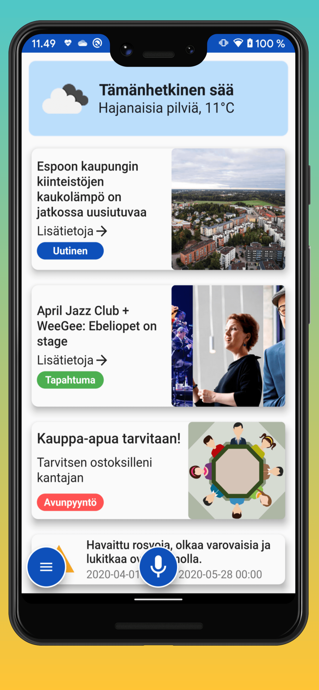

# My Espoo - Concept app

This project is a concept demo application on a 'Smart City' - online platform for the city of Espoo. The app combines local news, community events, guides and other hyper local information. It also serves as a tool for communities to create carpools, seeks and give help on houdehold tasks and also contains an online marketplace.

The app has been programmed in Dart with the help of Flutter SDK. Firebase (Cloud Firestore, Firebase Cloud Messaging and Cloud functions) is used for the backend. Android APK can be found in releases.

The app combines data from Espoo Open APi https://www.espoo.fi/fi-FI/Asioi_verkossa/Muut_palvelut/Espoofisivuston_avoimet_rajapinnat/Espoofisivuston_avoimet_rajapinnat(45868) and custom Firebase database. Data is used to build easily accesible visual elements, which are shown based on the users profile selections. Data filtering is based on user preferences and usage areas. For example, only events certain areas are shown and uninteresting functions are hidden. Profile can be edited inside the app and all changes are reflected instantly.

  
